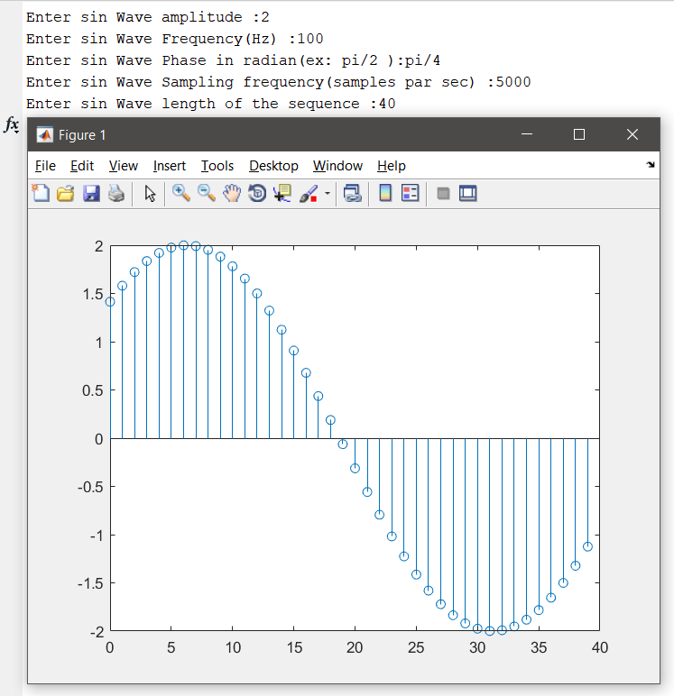

# Introduction to Matlab
 
## Introduction
Introduction to MATLAB environment: Command Window, Variables, Constants, Scalars, Matrices and Vectors, Functions, Comments, Command History, Workspace, Editor, Script file etc.

## Experiment 1-A
Write a MATLAB program to plot the discrete sine wave with given amplitude, frequency, phase, sampling frequency and length of the sequence. Also observe first alias.

    clc;
    clear all;
    close all;
    ampl = input('Enter sin Wave amplitude :');
    freq  = input('Enter sin Wave Frequency(Hz) :');
    phase  = input('Enter sin Wave Phase in radian(ex: pi/2 ):');
    sam_freq = input('Enter sin Wave Sampling frequency(samples par sec) :');
    length_of_secquence = input('Enter sin Wave length of the sequence :');
    f = freq/sam_freq;
    n = 0:1:length_of_secquence-1;
    y_n = ampl*sin(2*pi*f*n+phase);
    % x = phase:2*pi*sam_freq:phase+2*pi*sam_freq*length_of_secquence;
    % y = ampl*sin(x);
    figure(1);
    stem(n,y_n);

## Experiment 1-B
Write a MATLAB program for generation of DT unit impulse, step, and ramp sequence for a given initial time, final time and start of sequence.

