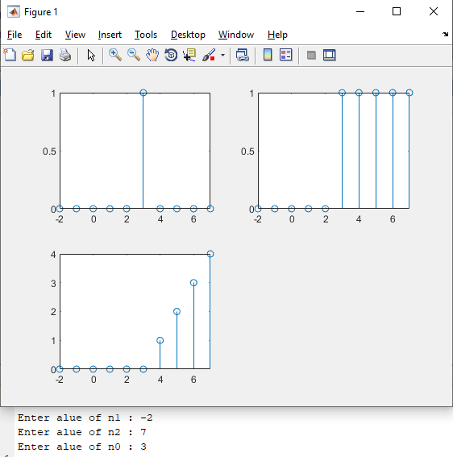

# Lab-2
## Experiment 1-B
###  Write a MATLAB program for generation of DT unit impulse, step, and ramp sequence for a given initial time, final time and start of sequence.

    clc;
    clear;
    close all;

    n1 = input('Enter alue of n1 : ');
    n2 = input('Enter alue of n2 : ');
    n0 = input('Enter alue of n0 : ');

    range = n2 - n1;
    x = n1:n2;
    unit_impulse = [zeros(1,abs(n0-n1)) ones(1,1) zeros(1,n2-n0)];

    figure(1);
    subplot(2,2,1);
    stem(x,unit_impulse);

    unit_step = [zeros(1,abs(n0-n1)) ones(1,n2-n0+1)];
    subplot(2,2,2);
    stem(x,unit_step);

    ramp = [zeros(1,abs(n0-n1)) 0:n2-n0];
    subplot(2,2,3);
    stem(x,ramp);

## Experiment 1-C
###  Write a MATLAB program for generation of an audio tone with given amplitude, frequency, phase,
### sampling frequency and length of the sequence. Store it in .wav file with given sampling frequency and BitsPerSample, read back and play the audio file.

    clc;
    clear all;
    close all;
    ampl = input('Enter sin Wave amplitude :');
    freq  = input('Enter sin Wave Frequency(Hz) :');
    phase  = input('Enter sin Wave Phase in radian(ex: pi/2 ):');
    sam_freq = input('Enter sin Wave Sampling frequency(samples par sec) :');
    length_of_secquence = input('Enter sin Wave length of the sequence :');
    f = freq/sam_freq;
    n = 0:1:length_of_secquence-1;
    y_n = ampl*sin(2*pi*f*n+phase);

    audiowrite('exp1c.wav',y_n,sam_freq,'Bitspersample',16);
    a = audioread('exp1c.wav');
    p = audioplayer(a,sam_freq);
    play(p);
