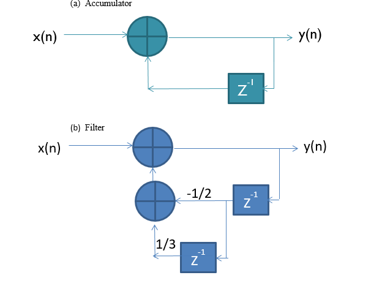
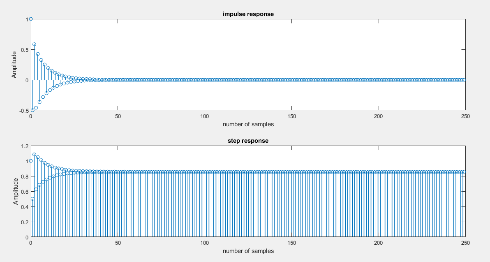

# Lab-3
## Experiment 2

(i)	Find rational Transfer function H(z) = B(z)/A(z) of given DT LTI systems analytically. 

(ii)	Write a MATLAB program to find and plot pole-zero pattern in z-plane, to determine stability, to find and plot unit impulse and unit step responses, to find and plot magnitude and phase responses (Frequency response plots)  if the given system is stable.

## Note: Use inbuilt functions: tf2zpk, zplane, isstable, impz,stepz, freqz.

      B = input('Numerator cofficient :');
      A = input('Denometer cofficient :');

      [z,p,k] = tf2zpk(B,A);

      disp('value of z : ');
      disp(z);
      disp('value of p : ');
      disp(p);
      disp('value of k : ');
      disp(k);

      figure(1)
      zplane(B,A);

      N = input('length of bounded input : ');

      [H,n] = impz(B,A,N);
      figure(2)
      subplot(2,1,1);
      stem(n,H);
      title('impulse response');
      xlabel('number of samples');
      ylabel('Amplitude');

      [S,n]= stepz(B,A,N);
      subplot(2,1,2);
      stem(n,S);
      title('step response');
      xlabel('number of samples');
      ylabel('Amplitude');

      f = isstable(B,A);
      if(f==0)
          disp('system is unstable');
      else
          disp('system is stable');
          W = -pi:pi/255:pi;
          H = freqz(B,A,W);

          figure(3)

          subplot(2,1,1);
          plot(W,abs(H));
          title('frequency response');
          xlabel('omega');
          ylabel('magnitude');

          subplot(2,1,2);
          plot(W,angle(H));
          title('frequency response');
          xlabel('omega');
          ylabel('phase');

      end

# 1) Accumulator

# 2) Filter

