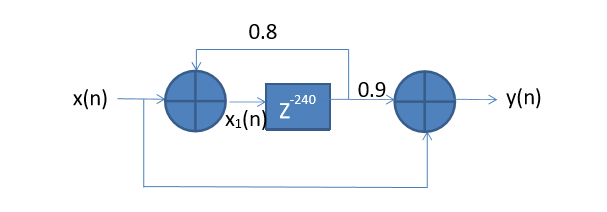
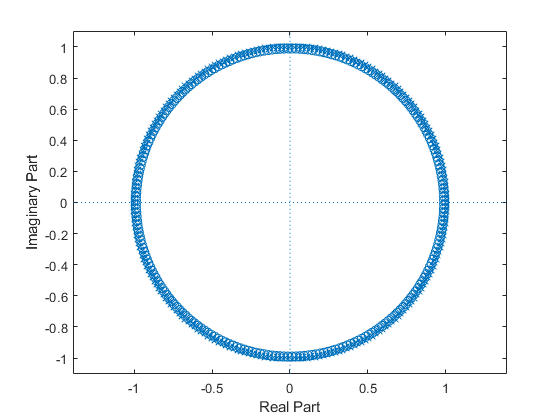
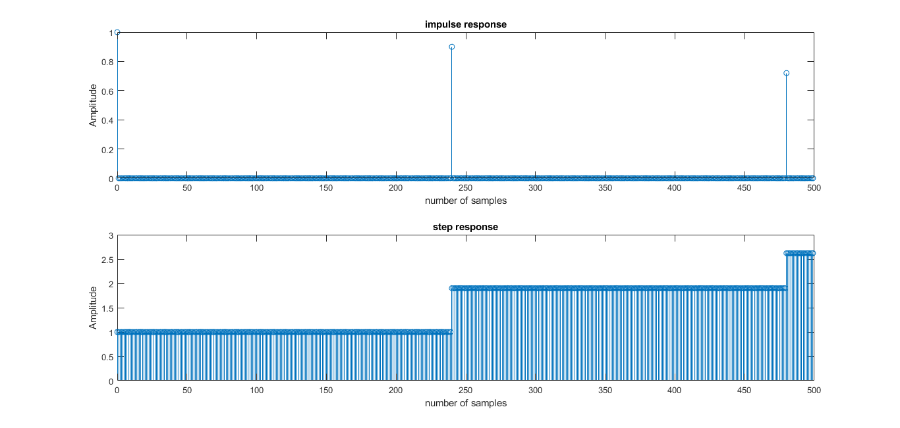
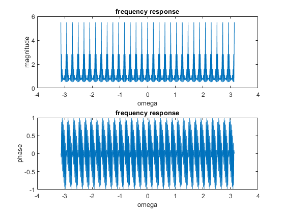

 # Experiment-3
 
### (i) Reverberation is similar to the echo effect we can hear when we shout across an open valley or canyon, or in a large empty room. The following figure gives one such model of reverberation. Find the transfer function and frequency response. Write a program to display its frequency response and impulse response. 

     B = input('Numerator cofficient :');
     A = input('Denominator cofficient :');

     [z,p,k] = tf2zpk(B,A);

     disp('value of z : ');
     disp(z);
     disp('value of p : ');
     disp(p);
     disp('value of k : ');
     disp(k);

     figure(1)
     zplane(B,A);

     N = input('length of bounded input : ');

     [H,n] = impz(B,A,N);
     figure(2)
     subplot(2,1,1);
     stem(n,H);
     title('impulse response');
     xlabel('number of samples');
     ylabel('Amplitude');

     [S,n]= stepz(B,A,N);
     subplot(2,1,2);
     stem(n,S);
     title('step response');
     xlabel('number of samples');
     ylabel('Amplitude');

     f = isstable(B,A);
     if(f==0)
         disp('system is unstable');
     else
         disp('system is stable');
         W = -pi:pi/255:pi;
         H = freqz(B,A,W);

         figure(3)

         subplot(2,1,1);
         plot(W,abs(H));
         title('frequency response');
         xlabel('omega');
         ylabel('magnitude');

         subplot(2,1,2);
         plot(W,angle(H));
         title('frequency response');
         xlabel('omega');
         ylabel('phase');

     end

## Input : 
#### Numerator cofficient : [1 zeros(1,239) 0.1]
#### Denominator cofficient :[1 zeros(1,239) -0.8]

## Output :

## Note: Use inbuilt function: impz, freqz. 
### (ii) Apply an audio signal of suitable length to this filter containing mixture of tones at 126Hz, 277Hz, 1050Hz, 2277Hz and 3400Hz with equal relative magnitudes and sampled at 8000Hz. Plot and hear its input and output using headphone/ear phone/speaker. 

# Experiment 4 
### (i) For M-tap moving average filter, plot the magnitude and phase response for different values of M using MATLAB.  
## Note: Use inbuilt function: freqz. 
### (ii) Write a MATLAB program to generate a signal x(n)=2n (0.95)n; 0≤n≤99. Corrupt it by additive random noise with amplitude in interval [-0.5 0.5]. Apply the signal to a Moving average filter with given tap length. Plot the input signal, noise signal, corrupted signal and filtered signal in same plot. Use proper labels and legends. Note: Use inbuilt functions: rand, filter  
 
