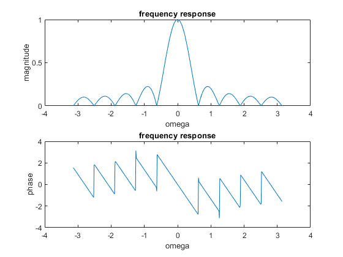

# Experiment 4

### 1) For M-tap moving average filter, plot the magnitude and phase response for different values of M using MATLAB.
### Note: Use inbuilt function: freqz.

    M = input('Enter the value of M:');
    B = 1/M*ones(1,M);
    A = input('Denominator cofficient :');
    N=M-1;

    W = -pi:pi/255:pi;
    H = freqz(B,A,W);

    figure(1)

    subplot(2,1,1);
    plot(W,abs(H));
    title('frequency response');
    xlabel('omega');
    ylabel('magnitude');

    subplot(2,1,2);
    plot(W,angle(H));
    title('frequency response');
    xlabel('omega');
    ylabel('phase');

### Input:
    Enter the value of M:10
    Denominator cofficient :2

### 2)  Write a MATLAB program to generate a signal x(n)=2n (0.95) n ; 0≤n≤99. Corrupt it by additive random noise with amplitude in interval [-0.5 0.5]. Apply the signal to a Moving average filter with given tap length. Plot the input signal,noise signal, corrupted signal and filtered signal in same plot. Use proper labels and legends.
### Note: Use inbuilt functions: rand, filter
