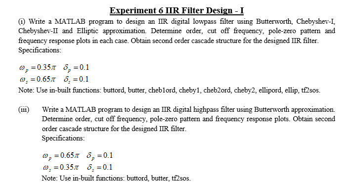

# EXP 5

### Code 1
      N  = input('Length of window: ');
      n = 0:N-1;
      w0 = window(@rectwin,N);
      w1 = window(@blackman,N);
      w2 = window(@bartlett,N);
      w3 = window(@hann,N);
      w4 = window(@hamming,N);
      plot(n,w0, n,w1, n,w2, n,w3, n,w4);
      xlabel('n');
      ylabel('W(n)');
      title('Window in time domain');
      legend('Rectangular Window', 'Blackman', 'Bartlett', 'Hanning', 'Hamming');
      w = -pi:pi/255:pi;
      H1 = freqz(w0,1,w);
      H2 = freqz(w1,1,w);
      H3 = freqz(w2,1,w);
      H4 = freqz(w3,1,w);
      H5 = freqz(w4,1,w);
      figure(2);
      plot(w,abs(H1), w,abs(H2), w,abs(H3), w,abs(H4), w,abs(H5));
      xlabel('w');
      ylabel('Magnitude');
      title('Window in frequency domain(Magnitude Response)');
      legend('Rectangular Window', 'Blackman', 'Bartlett', 'Hanning', 'Hamming');
      figure(3);
      plot(w,angle(H1), w,angle(H2), w,angle(H3), w,angle(H4), w,angle(H5));
      xlabel('w');
      ylabel('Phase');
      title('Window in frequency domain(Phase Response)');
      legend('Rectangular Window', 'Blackman', 'Bartlett', 'Hanning', 'Hamming');

### Code 2
      Wp = 0.3;
      Ws = 0.2;
      Ap = 0.25;
      As = -50;
      trans_W = (Wp-Ws)*pi;
      Wc = (Wp+Ws)/2;
      disp('Cutoff Freq ');
      disp(Wc);
      M = ceil((6.6*pi)/trans_W);
      if(rem(M,2) == 0)
         M = M + 1;
      end
      disp('Order ');
      disp(M);
      n = 0:M-1;
      w_n = window(@hamming,M);
      B = fir1(M-1, Wc, 'high', w_n);
      figure(1);
      freqz(B,1)
      title('Frequency Response of Filter');

      w_ns = 0:pi/255:Ws*pi;
      Hs = freqz(B,1,w_ns);
      Hsmag = abs(Hs);
      HsdB = 20*log10(Hsmag);
      as = max(HsdB);
      disp('Stop Band Attenuation');
      disp(as);

      w_np = Wp*pi:pi/255:pi;
      Hp = freqz(B,1,w_np);
      Hpmag = abs(Hp);
      HpdB = 20*log10(Hpmag);
      ap = max(HpdB);
      disp('Pass Band Attenuation');
      disp(ap);
      
 ## Output 
      Cutoff Freq 
          0.2500
      Order 
          67
      Stop Band Attenuation
        -52.7511
      Pass Band Attenuation
          0.0071

# EXP 6

# EXP 7

